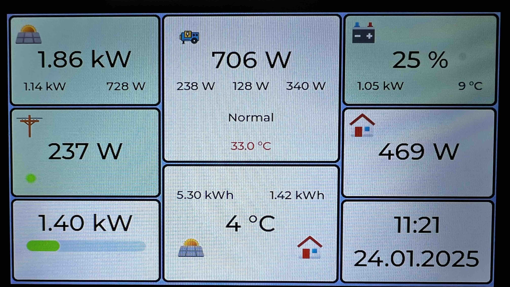
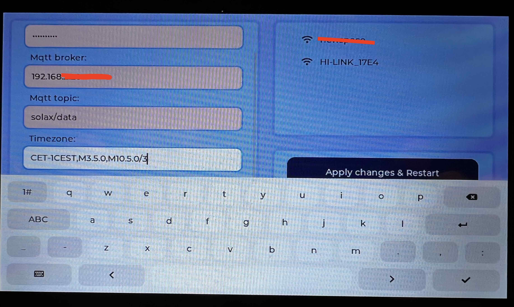
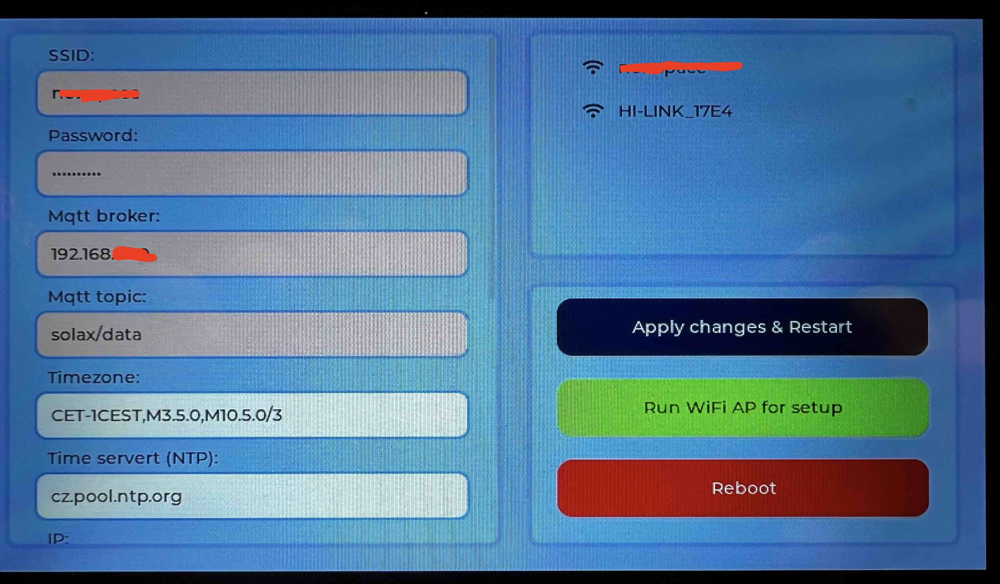
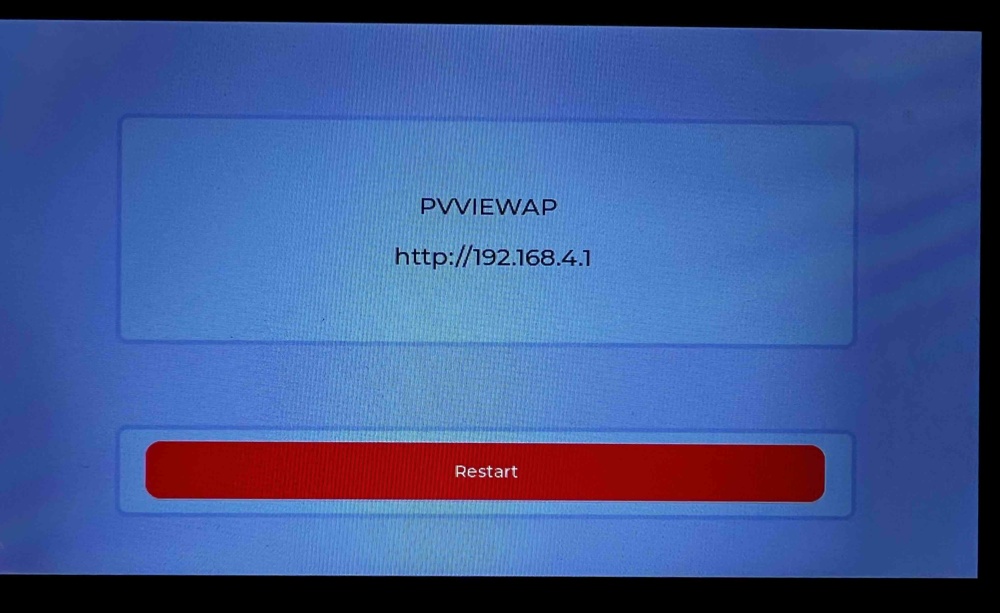

# Photovoltaic view
The PV View 7 project serves as a small data monitor for photovoltaic power plants. Data without mqtt source. In general, it can be used for any photovoltaic power plant. One possible source is e.g. the solax gateway, which provides data from the solar power plant to a predefined mqtt topic (see [solax gtw](https://github.com/xventus/solax_gtw)).  The project is written directly for the ESP IDF SDK. 
## Hardware
This view is based on the ESP32-S3 7inch Capacitive Touch Display.

[Link to SP32-S3 7inch Capacitive Touch Display](https://www.waveshare.com/wiki/ESP32-S3-Touch-LCD-7)

## UI

The tiles on the display show the individual parts of the PV system. 

The engine icon represents the inverter performance and temperature. By clicking on it you can go to the AP activation for setting purposes.

The bar graph on the right shows the free power accumulation. In case the free power is not available, it is shown in red and it is the consumption that is not covered by PV or battery. If the bar graph is green, on the other hand, it shows how much free power is available.

By clicking on the graph you can switch between the display of energy consumption days, energy production days and text display.

Most PV system graphs show the current performance per case. This shows the energy produced/consumed in time per hour. Useful for a quick understanding of how much energy has been produced and consumed during each hour of the day.
Provides information on overall daily trends, which is useful for planning and optimization.

Note: In the graph the information about "Max" indicates the maximum energy consumption/production during the day (Wh). The sum of all energies is in the text part.

<table>
    <tr>
        <td></td>
        <td></td>
        <td></td>
        <td></td>
     </tr>
</table>

## TODO

- Fix ResetTask - when a reboot is requested, the task crashes and then restarts.
- Fix unsubscribe call when connection is lost.

